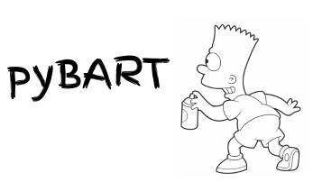

<div align="center">
    <br>
    
    <p>
   A Python converter from Universal-Dependencies trees to <b>BART</b> representation.<br>
        Try out our UD-BART comparison <a href="http://nlp.biu.ac.il/~aryeht/eud/">Demo</a>
    </p>
    <hr/>
</div>
<br/>

BART (**B**ar-Ilan & **A**I2 **R**epresentation **T**ransformation) is our new and cool enhanced-syntatic-representation specialized to improve Relation Extraction, but suitable for any NLP down-stream task.

See our [pyBART: Evidence-based Syntactic Transformations for IE](http://arxiv.org/abs/2005.01306) for detailed description of BART's creation/linguisical-verification/evaluation processes, and list of conversions.

This project is part of a wider project series, related to BART:
1. [**Converter:**](#converter-description) The current project.
2. [**Model:**](https://github.com/allenai/ud_spacy_model) UD based [spaCy](https://spacy.io/) model (pip install [the_large_model](https://storage.googleapis.com/en_ud_model/en_ud_model_trf-2.0.0.tar.gz)). This model is needed when using the converter as a spaCy pipeline component (as spaCy doesn't provide UD-format based models).
3. [**Demo:**](http://nlp.biu.ac.il/~aryeht/eud/) Web-demo making use of the converter, to compare between UD and BART representations.

## Table of contents

- [Converter description](#converter-description)
- [Installation](#installation)
- [Usage](#usage)
  * [spaCy pipeline component](#spacy-pipeline-component)
  * [CoNLL-U format](#conll-u-format)
- [Configuration](#configuration)
- [Citing](#citing)
- [Team](#team)

<small><i><a href='http://ecotrust-canada.github.io/markdown-toc/'>Table of contents generated with markdown-toc</a></i></small>

## Converter description

 * Converts UD (supports both versions 1 and 2) to BART.
 * Supports Conll-U format, spaCy docs, and spaCy pipeline component (see [Usage](#usage)).
 * Highly configurable (see [Configuration](#configuration)).

**Note:** The BART representation subsumes Stanford's EnhancedUD conversions, these conversions are described [here](http://www.lrec-conf.org/proceedings/lrec2016/pdf/779_Paper.pdf), and were already implemented by [core-NLP Java converter](https://nlp.stanford.edu/software/stanford-dependencies.shtml). As such they were not avialable to python users and thus we have ported them to pyBART and tried to maintain their behavior as much as reasonable.

## Installation

pyBART requires Python 3.7 or later. The preferred way to install pyBART is via `pip`. Just run `pip install pybart-nlp` in your Python environment and you're good to go!
If you want to use pyBART as a spaCy pipeline component, then you should install as well: (1) the spaCy package and (2) a spaCy-model based on UD-format (which we happen to provide (details are [here](https://github.com/allenai/ud_spacy_model))

```bash
# if you want to use pyBART as a spaCy pipeline component, well,
#   you need spaCy installed and a transformer-based spaCy model (based on UD-format):
pip install spacy
pip install https://storage.googleapis.com/en_ud_model/en_ud_model_trf-2.0.0.tar.gz

# or if you want non-trandformer-based smaller models:
#   large: https://storage.googleapis.com/en_ud_model/en_ud_model_lg-2.0.0.tar.gz
#   medium: https://storage.googleapis.com/en_ud_model/en_ud_model_md-2.0.0.tar.gz
#   small: https://storage.googleapis.com/en_ud_model/en_ud_model_sm-2.0.0.tar.gz

# and this is us. please don't confuse with pybart/bart-py/bart
pip install pybart-nlp
```

## Usage

Once you've installed pyBART, you can use the package in one of the following ways.
Notice, in the spacy mode we assign a method in the doc context named "get_pybart" which returns a list of lists. Each list corresponds to a sentence in doc.sents, and contains a list of edge dictionaries. Each edge contains the following fields: "head", "tail", and "label". "head" and "tail" can be either a reference to the corresponding spacy Token or a string representing an added node (and as such can't have a spacy Token reference).  
Notice that for both methods the API calls can be called with a list of optional parameters to configure the conversion process. We will elaborate about them next.

### spaCy pipeline component

```python
import spacy
from pybart.api import *

# Load a UD-based english model
nlp = spacy.load("en_ud_model_sm") # here you can change it to md/sm/lg as you preffer

# Add BART converter to spaCy's pipeline
nlp.add_pipe("pybart_spacy_pipe", last="True", config={'remove_extra_info':True}) # you can pass an empty config for default behavior, this is just an example

# Test the new converter component
doc = nlp("He saw me while driving")
for i, sent in enumerate(doc._.get_pybart()):
    print(f"Sentence {i}")
    for edge in sent:
        print(f"{edge['head']} --{edge['label']}--> {edge[tail']}")

# Output:
# Sentence 0:
# saw --root--> saw
# saw --nsubj--> He
# saw --dobj--> me
# saw --advcl:while--> driving
# driving --mark--> while
# driving --nsubj--> He
```

### CoNLL-U format

```python
from pybart.api import convert_bart_conllu

# read a CoNLL-U formatted file
with open(conllu_formatted_file_in) as f:
  sents = f.read()

# convert
converted = convert_bart_conllu(sents)

# use it, probably wanting to write the textual output to a new file
with open(conllu_formatted_file_out, "w") as f:
  f.write(converted)
```

## Configuration

Each of our API calls can get the following optional parameters:

[//]: # (<style>.tablelines table, .tablelines td, .tablelines th {border: 1px solid black;}</style>)


| Name | Type | Default | Explanation |
|------|------|-------------|----|
| enhance_ud | boolean | True | Include Stanford's EnhancedUD conversions. |
| enhanced_plus_plus | boolean | True | Include Stanford's EnhancedUD++ conversions. |
| enhanced_extra | boolean | True | Include BART's unique conversions. |
| conv_iterations | int | inf | Stop the (defaultive) behaivor of iterating on the list of conversions after `conv_iterations` iterations, though before reaching convergance (that is, no change in graph when conversion-list is applied). |
| remove_eud_info | boolean | False | Do not include Stanford's EnhancedUD&EnhancedUD++'s extra label information. |
| remove_extra_info | boolean | False | Do not include BART's extra label information. |
| remove_node_adding_conversions | boolean | False | Do not include conversions that might add nodes to the given graph. |
| remove_unc | boolean | False | Do not include conversions that might contain `uncertainty` (see paper for detailed explanation). |
| query_mode | boolean | False | Do not include conversions that add arcs rather than reorder arcs. |
| funcs_to_cancel | List\[str\] | None | A list of conversions to prevent from occuring by their names. Use `get_conversion_names` for the full conversion name list |
| ud_version | int | 1 | Which UD version to expect as input and to set the converter to. Currently we support 1 and 2. |

[//]: # ({: .tablelines})

## Citing

If you use pyBART or BART in your research, please cite [pyBART: Evidence-based Syntactic Transformations for IE](http://arxiv.org/abs/2005.01306).

```bibtex
@inproceedings{Tiktinsky2020pyBARTES,
  title={pyBART: Evidence-based Syntactic Transformations for IE},
  author={Aryeh Tiktinsky and Yoav Goldberg and Reut Tsarfaty},
  booktitle={ACL},
  year={2020}
}
```

## Team

pyBART is an open-source project backed by [the Allen Institute for Artificial Intelligence (AI2)](https://allenai.org/), and by Bar-Ilan University as being part of [my](https://github.com/aryehgigi) thesis under the supervision of Yoav Goldberg.
AI2 is a non-profit institute with the mission to contribute to humanity through high-impact AI research and engineering.
Our team consists of Yoav Goldberg, Reut Tsarfaty and myself. Currently we are the contributors to this project but we will be more than happy for anyone who wants to help, via Issues and PR's.
