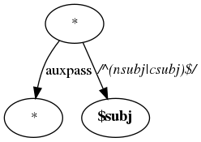
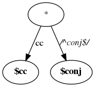
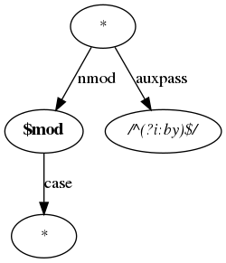
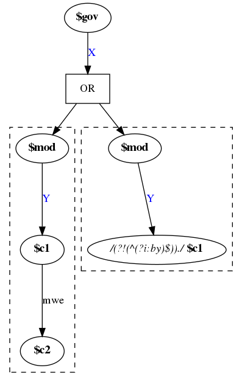
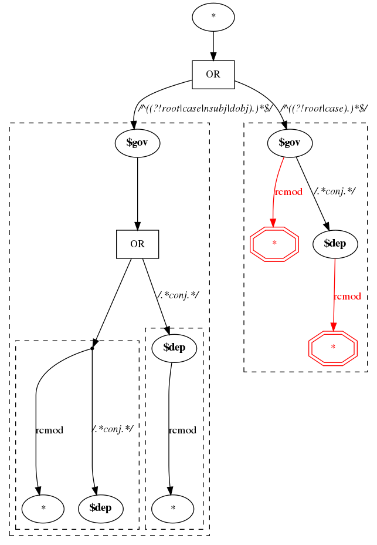
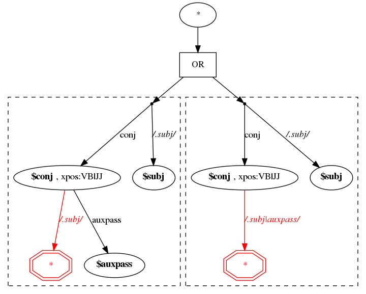
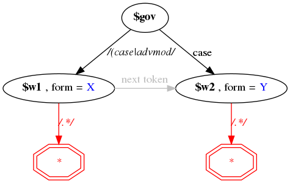
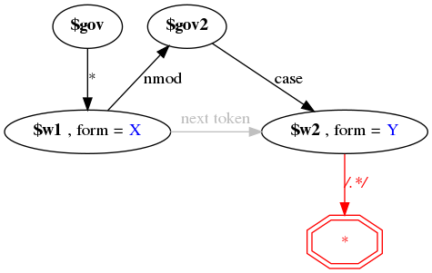

## Visualization of some of the matching rules

##### correct_subj_pass

##### conj_info

##### passive_agent

##### prep_patterns

##### conjoined_subj

##### conjoined_verb

##### simple_2wp

##### complex_2wp

